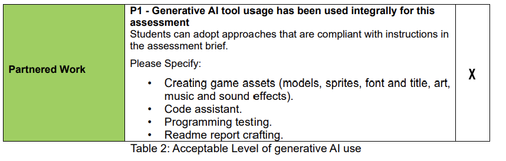

# 3015-CW1
# System information
## Visual studio version:2022
## Operating system: Windows 11

# How does it work? 
## Interactivity 
Using the GLFW library, the ability to move the camera/view was implemented. Using GLFW key detection WASD movement was implemented, this was done by using the code from the 3016 module as a base, then reworking it to fit in with the template and code used in this prototype. To actually get the code to recognise the key inputs and act on them,the 'ProcessUserInput' was first created in the Scenebasic_uniform class(this was where the code to move the camera position was placed).
Then in the 'mainLoop' in scenerunner, glfw will check for inputs, and if a key was pressed it will call the previosuly mentioned function, passing the pressed key so it can act accordingly. In addition a virtual instance of the ProcessUserInput function was placed in Scene.h to allow the code in Scenerunner to access it. The function in scenebasic uniform then overrides this 
## How the scene fits together 
The scene itself has multiple parts which all come together to make the complete scene.
Firstly, a skybox is present. This creates a backdrop wherever you look in the scene so that it appears the scene is set in the middle of a forest 
In the center of that skybox is a simple piece of terrain,this was a flat surface that acted as a base for the other parts of the scene, preventing them from just appearing floating. To ensure the floor created did not conflict with the skybox, it was set to be covered by the texture used for the bottom of the skybox. While it is still possible to zoom out and see where the skybox starts and the base ends, the majority of angles are enhanced by this effect and it helps the scene look like it is placed in a forest. With the scene set, the focus could now be moved to objects within the scene. To start of, the centerpiece (the sword in the stone) was placed. This was placed right in the center of the scene/view as it was intended as the most important part of the scene
In addition to this main model, a variety of other models were placed to help the scene feel populated

# How does your code fit together and how should a programmer navigate it (not intended to be an exercise in formally documenting the code)?
## Libraries/externals used 

## Code arrangement 
The code is split into a few different parts, the vertex/fragment shaders, the Scenerunner and the Scenebasic uniform class. 
### Shaders
### Scenebasic uniform 
#### render
Render was the function where all code associated with rendering was placed. The function was called frequently, constantly re rendering the scene to keep the view up to date with any transformations that have occured. For ease of organising code, different rendering parts were put into their own functions which were then called by render. For example the sword object has its own function that sets the model to the right position and then renders it 
In the process of rendering, the shaders are interacted allowing for values in the shaders to be updated to ensure they render in accordance with the current scene. For example the light position is passed to ensure that when a model is rendered the light is placed correctly

# Anything else which will help us to understand how your prototype works.
## Model credit 
Some models/resources used were found online. Below is links to the creators/suppliers of these models 
Sword in stone: https://sketchfab.com/3d-models/low-poly-sword-in-stone-974632056a2e4da299021824ec3df427#download 
Sky box/ground texture : https://opengameart.org/content/forest-skyboxes 
Tree: https://free3d.com/3d-model/tree02-35663.html?dd_referrer=
# A Link to the unlisted YouTube Video 
# AI statement
  
Ai was used in a partnered role in the development of this prototype. For details on its use please see below
## Uses 
### Creating game assets
Ai was used to create png textures for models that otherwise did not come with them, for example the texture for the sword was generated by AI. Initally the model itself was intended to be generated by AI too, but after trying a few times the desired model could not be created in a usable state.
During development, the intention was to implement normal mapping, and for this purpose a normal map of the sword texture was created which was done with AI. While this was not used in the final version it can be seen in the files 
### code assistant
AI tools were used throughout development as a coding assistant. A key example of this was debugging. When a situation arose where the problem is not instantly noticable and finding it may take excessive time, AI was asked to pin point where the problem was. For example, at one point the lighting was getting attached to the camera in a strange way and thus the lighting for models was off. In this case AI was able to point out that I was passing the wrong value due to a piece of code I had missed that was overriding correct values.
It was also used as a coding assistant to advise on how to move forward with sections I was not initally sure how too. For example, when programming the camera movement, I was unsure initally how to edit the position and use GLFW functionality if the GLFW window was in scene runner but I was wanting to place code for this in scenebasic uniform. The AI suggested the solution (mentioned in the how does it work section) which I was then able to implement 
It was also a great help in shaders when it came to assisting with solving issues as this was an area where lots of isses arose when developing
