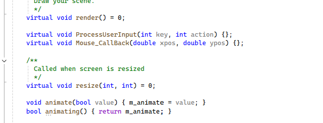
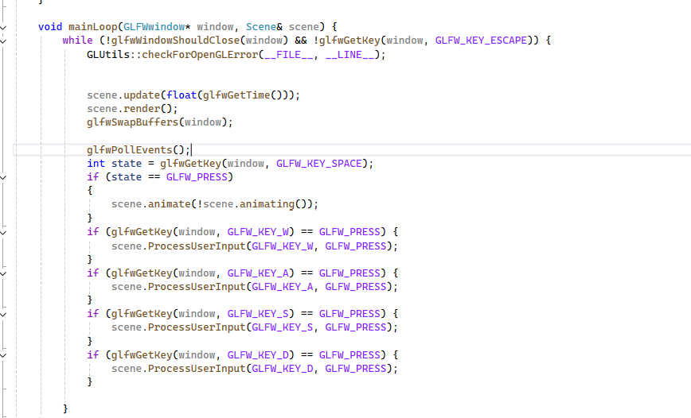
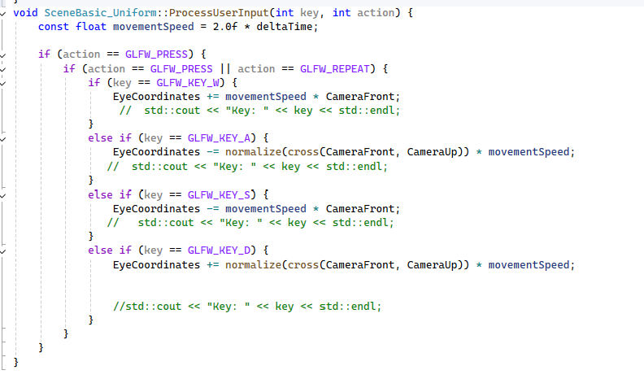
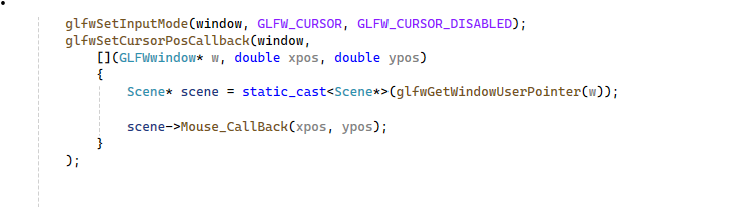
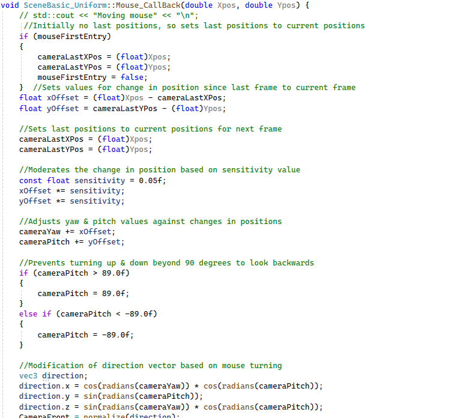
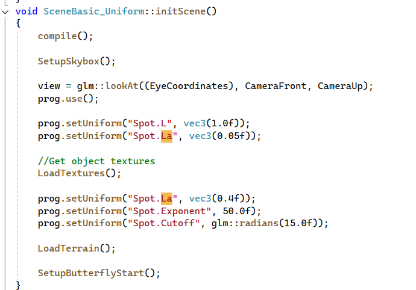
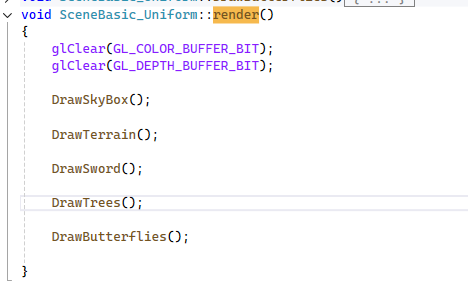
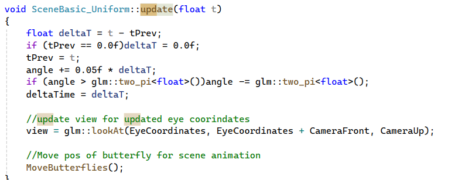
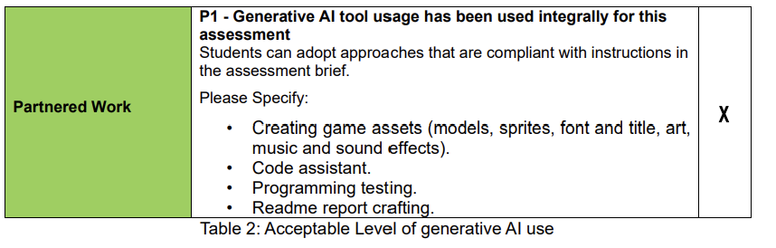

# Important 
## Add video link 

# 3015-CW1
By Harry Watton
# System information
## Visual studio version:2022
## Operating system: Windows 11

# How does it work? 
## Interactivity 
### WASD Keyboard controls
Using the GLFW library, the ability to move the camera/view was implemented. Using GLFW key detection WASD movement was implemented, this was done by using the code from the 3016 module as a base, then reworking it to fit in with the template and code used in this prototype. To actually get the code to recognise the key inputs and act on them,the 'ProcessUserInput' was first created in the Scenebasic_uniform class(this was where the code to move the camera position was placed).
Then in the 'mainLoop' in scenerunner, glfw will check for inputs, and if a key was pressed it will call the previously mentioned function, passing the pressed key so it can act accordingly. In addition a virtual instance of the ProcessUserInput function was placed in Scene.h to allow the code in Scenerunner to access it. The function in scenebasic uniform then overrides this. 
The end result of this allowed for the WASD keys to act as direction inputs, with W as forward,a as left, s as back and d as right

### Mouse controls
Similar was done with mouse controls, with a function placed in scene basic uniform and then a reference added in scene.h. In addition this function was set to mouse call back in scene runner.h 

The end result was the mouse controlling the direction of the camera allowing for the user to see the scene with a view from many angles

## How the scene elements fits together 
The scene itself has multiple parts which all come together to make the complete scene.
### skybox and terrain ground 
Firstly, a skybox is present. This creates a backdrop wherever you look in the scene so that it appears the scene is set in the middle of a forest 
In the center of that skybox is a simple piece of terrain,this was a flat surface that acted as a base for the other parts of the scene, preventing them from just appearing floating. To ensure the floor created did not conflict with the skybox, it was set to be covered by the texture used for the bottom of the skybox. While it is still possible to zoom out and see where the skybox starts and the base ends, the majority of angles are enhanced by this effect and it helps the scene look like it is placed in a forest. 
### Models
With the scene set, the focus could now be moved to objects within the scene. To start off, the centerpiece (the sword in the stone) was placed. This was placed right in the center of the scene/view as it was intended as the most important part of the scene
In addition to this main model, other models were placed around to help the scene feel populated. A key example of this is the trees that were placed around. These were placed in a variety of locations to make the setting of the forest around the sword feel present. These were placed around the sword on all sides except the front, allowing for a clear view from where the camera starts. Additionally they were placed 2-3 trees deep on each side to present a populated forest surrounding the sword.
The trees also serve the purpose of hiding the somewhat harsh transition between the actual trees and the sky box background.
Another model that was placed in the scene was a butterfly, this was quite a small model but it added some extra colour to the scene and helped the scene feel alive. In addition it had some scene animations allowing it to move back and forth to add life to the scene 

# How does your code fit together and how should a programmer navigate it 
## Libraries/externals used 
- glad 
- GLFW
- GLM
- Open gl
In addition, external code provided by this module (Comp 3015) was used

## Code arrangement 
The code is built around the template provided and makes use of both C++ code and fragment and vertex shaders. 
### Shaders
For better organisation, the shaders are spread between 3 different shaders(each with a fragment and vertex shader), these are the object/model shaders, terrain shaders and the skybox shaders. These all complete very separate functionalities which is why they are separated from each other.
### Object shaders 
Object shaders were the most important shader as they provided lighting and attached textures to the different objects within the scene. These were implemented in the "FinalFragmentShader.frag" and "FinalVertexShader.vert" files
#### Toon shading 
Toon shading was implemented in the shader to give the scene a more cartoony look. This was done by adding less of a gradual shift between different light levels to emulate the look of how cartoons are drawn/shaded. This can be seen where scalefactor and shaderlevels are used.
#### Spotlight 
To highlight the center piece of the scene (the sword in stone model) a spotlight was used. This slowly moves around the model to highlight different parts of it and how it looks under different levels of shading. This was implemented by checking the position of each part of the model relative to the source of the spotlight, and based on the light intensity of that position of the spotlight, the model will have its light level adjusted accordingly. This allowed for the sword to be highlighted in quite an interesting way
#### Blinnphong 
The main part of the code was to create the blinn phong shading model, which acted as the core of the object shaders. This calculated the lighting for each vertex based on the way the light was shining on it.This can be seen in the “blinnphongspot” function
#### Texture mixing and sampling
One of the key techniques used was the sampling of textures for the different objects in the scene. These were passed to the shaders after being loaded by C++ where they were then placed on the model accordingly 
In addition to this texture mixing was used, this allowed for extra looks/effects to be added to enhance other textures. For example the moss texture is mixed with the sword in the stone to give it an overgrown sort of look in line with the forest scene. 

### Skybox shaders
The skybox shaders were somewhat simple shaders, simply placing 6 textures on the insides of a cube around the scene. This can be seen in "SkyBoxFragmentShader.frag" and "SkyBoxVertexShader.vert"
### Terrain shaders  
The terrain shaders were created to specifically place the ground texture over the flat plain of space. As the terrain was set up with many different vertices, the shader was designed to draw a part of the whole texture on each part to make the complete texture displayed. 
Ai was used to assist with this, to see details of this please see the Ai statement later in this file 

## C++
C++ was used to arrange the scene and connect the shaders to it. This was split into a few parts as detailed below
### Scenerunner and Scene
These files from the template were modified slightly to allow for GLFW inputs to be detected, as otherwise implementing keyboard and mouse controls would have been more complicated. This included adding an input check in the main loop of scene runner, adding mouse callback in run and adding references to the process user input functions and mouse callback functions created in scene basic uniform to allow scenerunner code access to the functions. 
Please note, Ai was used to assist with connecting the functions in scene basic uniform. For more information on this please see the AI statement late in this document
### Scenebasic uniform 
#### Initialising 

The Init scene function was where all the key parts of the scene were set up. Notably (Mostly through functions called here)the shaders are compiled, vertexes for the terrain are created, the skybox is setup, the eye start position is set and some light values are set, this creates the base of the scene for the rendering later
#### rendering
Render was the function where all code associated with rendering was placed. The function was called frequently, constantly re-rendering the scene to keep the view up to date with any transformations that have occurred. For ease of organising code, different rendering parts were put into their own functions which were then called by render. For example the sword object has its own function that sets the model to the right position and then renders it. 
In the process of rendering, the shaders are interacted with, allowing for values in the shaders to be updated to ensure they render in accordance with the current scene. For example the light position is passed to ensure that when a model is rendered the light is placed correctly

#### Updating
The positions of various things throughout the scene are updated each frame (For example the position of the light and the position of the butterfly). This updating was done in the update function to keep it seperate from rendering code. 
The position of the camera is also updated to account for the users inputs

Please note the code for updating the light position was an edited version of code from one of the labs for this module

# Anything else which will help us to understand how your prototype works.
## Model credit 
Some models/resources used were found online. Below is links to the creators/suppliers of these models 
- Sword in stone: https://sketchfab.com/3d-models/low-poly-sword-in-stone-974632056a2e4da299021824ec3df427#download 
- Sky box/ground texture : https://opengameart.org/content/forest-skyboxes 
- Tree: https://free3d.com/3d-model/tree02-35663.html?dd_referrer= 
- Butterfly: https://www.turbosquid.com/3d-models/butterfly-fly-3d-obj/460590

## Partial re use of 3016 
It should be noted that very small parts of the scene used parts of the 3016 module as a base. For example the code to make the butterfly move back and forth was taken from my second coursework submission for that module. It was not just copied directly however, due to the different sizing of the scene, compared to the scene present in that project the movement speeds and distance was on an entirely different scale. So to adapt this to work with the current scene the movement speed was increased and the amount of time/amount of moves the model moves before turning was increased. In addition, it had its direction changed slightly, in the original code it would either travel vertically or horizontally across the scene requiring just a change to the x coordinate. But for this scene I decided I wanted it to travel diagonally, so the code was adjusted to accommodate for this. The butterfly model itself was also the same used in the 3016 coursework. To see the original source of this please see the section above
The terrain generation code was also created using code from the 3016 labs to set up a flat piece of ground. This was also adjusted, editing the size of the flat ground to better create the desired ground effect. Before then editing the terrain shader to display a texture over it(please note AI was used as to assist with this, for more information on this please see the use of AI statement)
## Usage of lab code 
Please also note that the code in this assignment is heavily based on different parts of the labs from this module
# A Link to the unlisted YouTube Video 
# AI statement
 
  
Ai was used in a partnered role in the development of this prototype. For details on its use please see below
## Uses 
### Creating game assets
Ai was used to create png textures for models that otherwise did not come with them, for example the texture for the sword was generated by AI due to the fact the model did not come with it. 
A full list of AI generated assets are detailed below(all files detailed below can be found in the textures folder in the media folder of the project)
- Sword texture
- Sword normal map texture
- tree bark texture
During development, the intention was to implement normal mapping, and for this purpose a normal map of the sword texture was created which was done with AI. While this was not used in the final version it can be seen in the files.
Note:Model creation with AI was experimented with but the desired results could not be created to a standard I was happy with. Therefore the models were instead found online
### code assistant
AI tools were used throughout development as a coding assistant. 
#### Debugging
A key example of how generative AI was used for code assistance debugging. When a situation arose where the problem is not instantly noticeable and finding it may take excessive time, AI was asked to pin point where the problem was. For example, at one point the lighting was getting attached to the camera in a strange way and thus the lighting for models was off. In this case AI was able to point out that I was passing the wrong value due to a piece of code I had missed that was overriding correct values.
#### Code suggestions 
It was also used as a coding assistant to advise on how to move forward with sections I was not initially sure how too initially. 
For example, when programming the camera movement, I was unsure initially how to edit the position and use GLFW functionality as the GLFW window was in scene runner and thus inaccessible to the code in scene basic uniform where I wanted to place the code. The AI suggested the solution (mentioned in the how does it work section) which I was then able to implement 
Another key example of where AI was used was for correctly setting up the texture on the terrain. Originally when setting this up the texture would repeat for every single "square" in the terrain, as the fragment shader was treating each square as an entirely separate object. This made the terrain look unusual and far from what was desired. While I was understanding the issue,I was unable to figure out exactly how to fix it. For this reason AI was used to point out where I was going wrong, suggesting the addition of new uniform values allowing the code to calculate which bit of the texture should be rendered on each "square" of the terrain grid.
It was also a great help in shaders when it came to assisting with solving issues as this was a key area where unexpected things could occur
